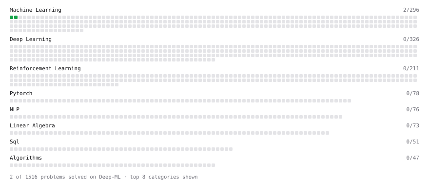

# Deep-ML

My machine learning practice from [Deep-ML](https://www.deep-ml.com). Every solution here was written by hand.

**5** solved · 2 problems · 3 labs · 0 math

[**Browse the interactive portfolio**](https://kendriyavid.github.io/deep-ml/) to replay this filling in over time.

## Problems

| | Difficulty | Solved | |
| --- | --- | --- | --- |
| [Linear Regression Using Gradient Descent](https://www.deep-ml.com/problems/15) | easy | 2026-10-05 | [solution](problems/0015-linear-regression-using-gradient-descent) |
| [Linear Regression Using Normal Equation](https://www.deep-ml.com/problems/14) | easy | 2026-10-05 | [solution](problems/0014-linear-regression-using-normal-equation) |

## Labs

| | Difficulty | Solved | |
| --- | --- | --- | --- |
| [PyTorch: Build a Complete Training Loop](https://www.deep-ml.com/labs/13) | easy | 2026-10-07 | [solution](labs/0013-pytorch-build-a-complete-training-loop) |
| [Train a Binary Classifier](https://www.deep-ml.com/labs/23) | easy | 2026-10-06 | [solution](labs/0023-train-a-binary-classifier) |
| [Train a Linear Regression Model](https://www.deep-ml.com/labs/18) | easy | 2026-10-06 | [solution](labs/0018-train-a-linear-regression-model) |

---

_This file is regenerated by Deep-ML on every push._
